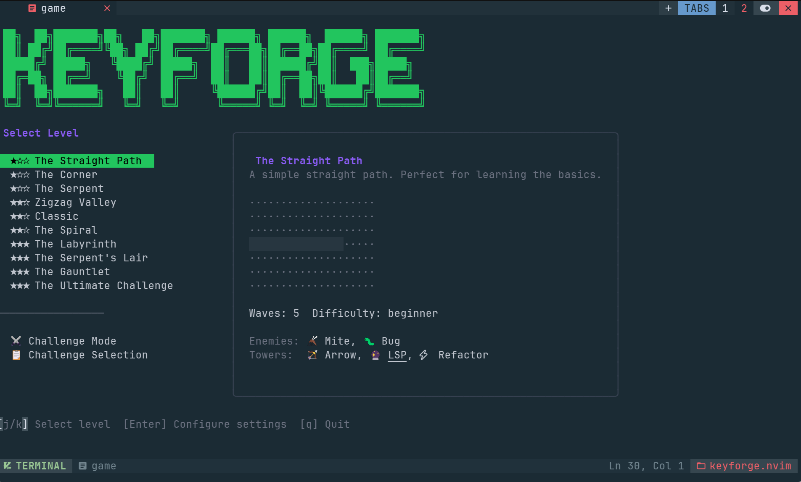
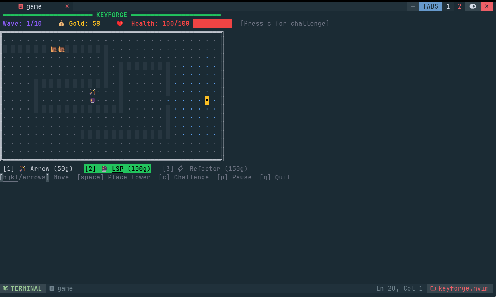
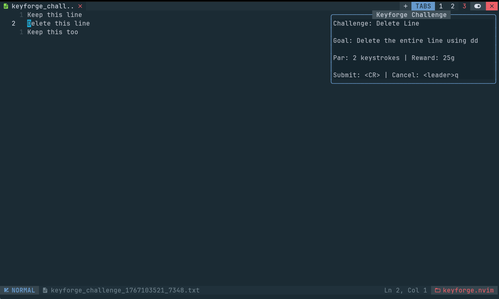
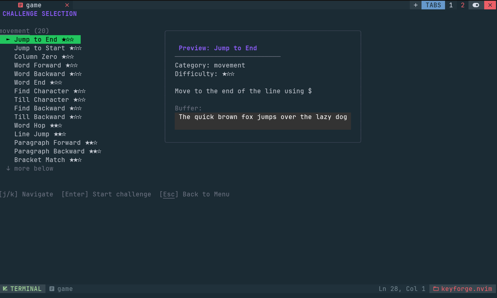
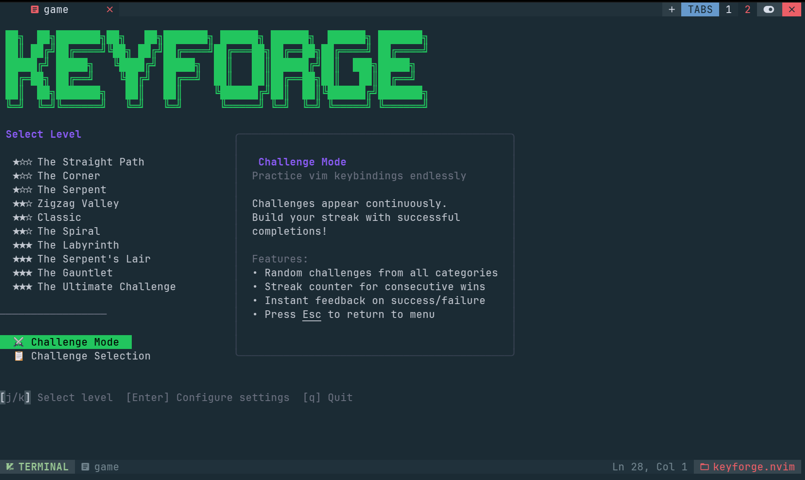
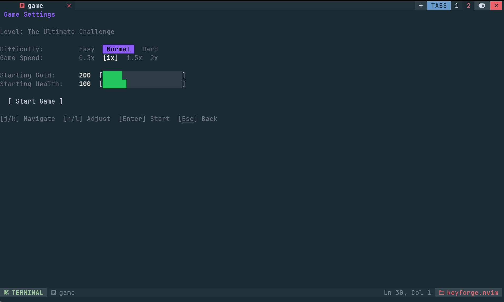

# keyforge.nvim

[](https://neovim.io)
[](https://go.dev)
[](https://github.com/patrickkoss/keyforge.nvim/actions)
[](https://github.com/patrickkoss/keyforge.nvim/releases)
[](LICENSE)
[](https://github.com/patrickkoss/keyforge.nvim)



**Master Vim through tower defense. Fight bugs with keystrokes.**

A tower defense game integrated into Neovim that gamifies learning vim keybindings and plugin workflows. Place towers, complete kata-style editing challenges to earn gold, and defend against waves of enemies across 10 unique levels.

## Features

- **10 Unique Levels** - From beginner straight paths to advanced labyrinths
- **7 Enemy Types** - Mites, Bugs, Gremlins, Crawlers, Specters, Daemons, and Bosses
- **3 Tower Types** - Arrow, LSP, and Refactor towers with upgrades
- **150+ Challenges** - Across 15 categories (movement, text objects, LSP, git, etc.)
- **Challenge Mode** - Endless practice with streak tracking
- **Tutorial System** - Guided introduction for new players
- **Plugin-Aware** - Challenges adapt to your installed plugins (Telescope, nvim-surround, etc.)
- **Speed Bonuses** - Complete challenges faster for up to 2x gold multiplier
- **Configurable** - Difficulty presets, game speed, starting resources

## Screenshots

<table>
  <tr>
    <td align="center">
      <br/>
      <em>Tower Defense Gameplay</em>
    </td>
    <td align="center">
      <br/>
      <em>Vim Kata Challenge</em>
    </td>
  </tr>
  <tr>
    <td align="center">
      <br/>
      <em>Level Selection</em>
    </td>
    <td align="center">
      <br/>
      <em>Endless Challenge Mode</em>
    </td>
  </tr>
  <tr>
    <td align="center" colspan="2">
      <br/>
      <em>Game Settings</em>
    </td>
  </tr>
</table>

## Game Modes

### Campaign Mode
Progress through 10 levels with increasing difficulty. Each level features unique map layouts, enemy compositions, and wave patterns. Complete all waves to unlock the next level.

### Challenge Mode
Endless vim kata practice with streak tracking. Perfect for warming up or drilling specific skills without tower defense pressure. Track your best streaks and efficiency scores.

### Tutorial
A step-by-step introduction covering movement, tower placement, upgrades, and wave mechanics. Great for first-time players.

## Game Content

### Levels

| Level | Name | Difficulty | Waves |
|-------|------|------------|-------|
| 1 | The Straight Path | Beginner | 5 |
| 2 | The Corner | Beginner | 5 |
| 3 | The Serpent | Beginner | 6 |
| 4 | Zigzag Valley | Intermediate | 7 |
| 5 | Classic | Intermediate | 8 |
| 6 | The Spiral | Intermediate | 8 |
| 7 | The Labyrinth | Advanced | 9 |
| 8 | The Serpent's Lair | Advanced | 9 |
| 9 | The Gauntlet | Advanced | 10 |
| 10 | The Ultimate Challenge | Advanced | 10 |

### Tower Types

| Tower | Cost | Damage | Range | Challenge Categories |
|-------|------|--------|-------|---------------------|
| Arrow 🏹 | 50g | 8 | 2.5 | Movement, Buffer, Window, Quickfix, Folding |
| LSP 🔮 | 100g | 20 | 5.0 | LSP Navigation, Telescope, Diagnostics, Formatting, Harpoon |
| Refactor ⚡ | 150g | 12 | 3.0 | Text Objects, Search/Replace, Refactoring, Surround, Git |

Each tower can be upgraded twice for increased damage, range, and attack speed.

### Enemy Types

| Enemy | Health | Speed | Gold | Description |
|-------|--------|-------|------|-------------|
| Mite 🦟 | 5 | 2.0 | 2 | Weakest, very fast |
| Bug 🐛 | 10 | 1.5 | 5 | Baseline enemy |
| Gremlin 👹 | 25 | 2.5 | 10 | Fast, medium health |
| Crawler 🐌 | 40 | 0.6 | 15 | Slow tank |
| Specter 👻 | 15 | 3.5 | 8 | Very fast, fragile |
| Daemon 👿 | 100 | 0.8 | 25 | Late-game tank |
| Boss 💀 | 500 | 0.5 | 100 | Final boss (Level 10) |

### Challenge Categories (15 total)

| Category | Count | Examples |
|----------|-------|----------|
| Movement | 20 | `$`, `w`, `f`, `G`, `%`, `Ctrl-O` |
| Text Objects | 18 | `ciw`, `da(`, `yi"`, `vib` |
| LSP Navigation | 15 | `gd`, `gr`, `K`, `<leader>rn` |
| Search & Replace | 12 | `*`, `:s`, `:%s/g`, `:g/d` |
| Refactoring | 10 | Extract variable, inline, rename |
| Git Operations | 12 | Stage hunks, blame, diff |
| Window Management | 10 | Splits, resize, navigation |
| Buffer Management | 8 | Buffer switching, delete, list |
| Folding | 8 | `za`, `zo`, `zc`, `zR`, `zM` |
| Quickfix | 8 | `]q`, `[q`, `:copen` |
| Diagnostics | 6 | `]d`, `[d`, `<leader>e` |
| Telescope | 10 | Find files, grep, buffers |
| Surround | 8 | Change quotes, wrap, delete |
| Harpoon | 5 | Mark files, quick navigation |
| Formatting | 5 | `<leader>f`, `=ip`, `:retab` |

## Requirements

- Neovim 0.11+
- Go 1.21+ (for building the game binary)
- A terminal with Unicode/emoji support (iTerm2, Alacritty, Kitty, Windows Terminal)

## Installation

### Using lazy.nvim

```lua
{
  "patrickkoss/keyforge.nvim",
  cmd = { "Keyforge", "KeyforgeStop", "KeyforgeBuild" },
  build = "make build",
  opts = {
    keybind = "<leader>K",
    keybind_next_challenge = "<leader>kn",
    keybind_complete = "<leader>kc",
    keybind_skip = "<leader>ks",
    keybind_submit = "<CR>",
    keybind_cancel = "<Esc>",
    difficulty = "normal",
    starting_gold = 200,
    starting_health = 100,
    auto_build = true,
    challenge_timeout = 300,
  },
  keys = {
    { "<leader>K", "<cmd>Keyforge<cr>", desc = "Keyforge: Start game" },
  },
}
```

### Using packer.nvim

```lua
use {
  "patrickkoss/keyforge.nvim",
  run = "make build",
  config = function()
    require("keyforge").setup({
      keybind = "<leader>K",
    })
  end
}
```

### Manual Installation

```bash
# Clone the repository
git clone https://github.com/patrickkoss/keyforge.nvim ~/.local/share/nvim/lazy/keyforge.nvim

# Build the game binary
cd ~/.local/share/nvim/lazy/keyforge.nvim
make build

# Add to your init.lua
# require("keyforge").setup()
```

## Usage

### Starting the Game

```vim
" Using the command
:Keyforge

" Using the default keybind
<leader>K
```

### Controls

#### In-Game (Tower Defense)

| Key | Action |
|-----|--------|
| `h/j/k/l` or Arrow Keys | Move cursor |
| `1`, `2`, `3` | Select tower type |
| `Space` or `Enter` | Place tower |
| `u` | Upgrade tower (when cursor on tower) |
| `p` | Pause/Resume game |
| `q` | Quit game |
| `r` | Restart (on game over) |

#### Menu Navigation

| Key | Action |
|-----|--------|
| `j/k` or Arrow Keys | Navigate options |
| `Space` or `Enter` | Select option |
| `h/l` or Arrow Keys | Adjust settings values |
| `q` or `Esc` | Back / Quit |
| `m` | Return to mode selection |

#### Challenge Controls

| Key | Action |
|-----|--------|
| `<leader>kn` | Start next challenge |
| `<leader>kc` | Complete current challenge (validate) |
| `<leader>ks` | Skip current challenge |

## Economy System

Keyforge uses a challenge-based economy where completing vim kata challenges is the primary source of gold:

### Gold Sources

| Source | Normal Difficulty |
|--------|-------------------|
| Mob Kills | 25% of base gold value |
| Wave Completion | 50% of bonus |
| **Challenge Completion** | **100% (primary source)** |

### Speed Bonus

Complete challenges faster for bonus gold:

| Speed | Bonus Multiplier |
|-------|------------------|
| Slower than par | 1.0x |
| At par | 1.0x |
| 2x faster | 1.5x |
| 4x+ faster | 2.0x (max) |

### Difficulty Presets

| Difficulty | Mob Gold | Wave Bonus | Description |
|------------|----------|------------|-------------|
| Easy | 50% | 75% | Good for learning |
| **Normal** | **25%** | **50%** | Balanced gameplay |
| Hard | 0% | 25% | Pure challenge mode |

## Configuration

```lua
require("keyforge").setup({
  -- Keybind to launch game (set to "" to disable)
  keybind = "<leader>K",

  -- Challenge keybinds
  keybind_next_challenge = "<leader>kn",
  keybind_complete = "<leader>kc",
  keybind_skip = "<leader>ks",
  keybind_submit = "<CR>",
  keybind_cancel = "<Esc>",

  -- Difficulty level: "easy", "normal", "hard"
  difficulty = "normal",

  -- Game speed: 0.5, 1.0, 1.5, 2.0
  game_speed = 1.0,

  -- Starting resources
  starting_gold = 200,
  starting_health = 100,

  -- Auto-build binary on first run
  auto_build = true,

  -- Challenge timeout in seconds
  challenge_timeout = 300,
})
```

## Commands

| Command | Description |
|---------|-------------|
| `:Keyforge` | Start the game |
| `:KeyforgeStop` | Stop the running game |
| `:KeyforgeBuild` | Rebuild the game binary |
| `:KeyforgeComplete` | Complete current challenge |

## Development

### Building

```bash
# Build the game binary
make build

# Run the standalone game (for testing)
make run

# Run tests
make test
```

### Project Structure

```
keyforge.nvim/
├── plugin/keyforge.lua       # Auto-loader
├── lua/keyforge/
│   ├── init.lua              # Main module, setup
│   ├── rpc.lua               # JSON-RPC communication
│   ├── challenges.lua        # Challenge validation
│   └── ui.lua                # Buffer management
├── game/                     # Go game engine
│   ├── cmd/keyforge/         # Entry point
│   └── internal/
│       ├── engine/           # Game logic
│       ├── entities/         # Towers, enemies, effects
│       ├── ui/               # Bubbletea TUI
│       └── nvim/             # RPC protocol
└── tests/                    # Lua tests (plenary)
```

### Running Tests

```bash
# Go tests
cd game && go test ./...

# Lua tests (requires plenary.nvim)
nvim --headless -c "PlenaryBustedDirectory tests/ {minimal_init = 'tests/minimal_init.lua'}"
```

## Custom Challenges

Create custom challenges in `~/.config/nvim/keyforge-challenges/`:

```yaml
# my-challenge.yaml
id: my_custom_challenge
name: "My Challenge"
category: movement
difficulty: 2
description: "Navigate to the target using vim motions"

initial_buffer: |
  function example() {
    return 42;
  }

validation_type: exact_match
expected_buffer: |
  function example() {
    return 0;
  }

par_keystrokes: 5
gold_base: 50
```

### Validation Types

- `exact_match`: Buffer must exactly match `expected_buffer`
- `contains`: Buffer must contain `expected_content`
- `cursor_position`: Cursor must be at expected position
- `function_exists`: A function named `function_name` must exist
- `pattern`: Buffer must match Lua pattern
- `different`: Buffer must be different from initial

## Plugin-Aware Challenges

Keyforge detects your installed plugins and shows challenges tailored to your setup:

| Plugin | Challenges Unlocked |
|--------|---------------------|
| Telescope | Fuzzy find files, live grep, buffer search |
| nvim-surround / mini.surround | Change quotes, add/remove surroundings |
| fugitive / gitsigns | Git status, stage hunks, blame |
| Harpoon | Mark files, quick navigation |

Challenge hints show **your actual keybindings**, not just defaults!

## Contributing

Contributions are welcome! Please read the contributing guidelines first.

## License

[Apache License Version 2.0, January 2004](./LICENSE)

## Credits

- Built with [Bubbletea](https://github.com/charmbracelet/bubbletea) and [Lipgloss](https://github.com/charmbracelet/lipgloss)
- Inspired by typing games and vim training tools
